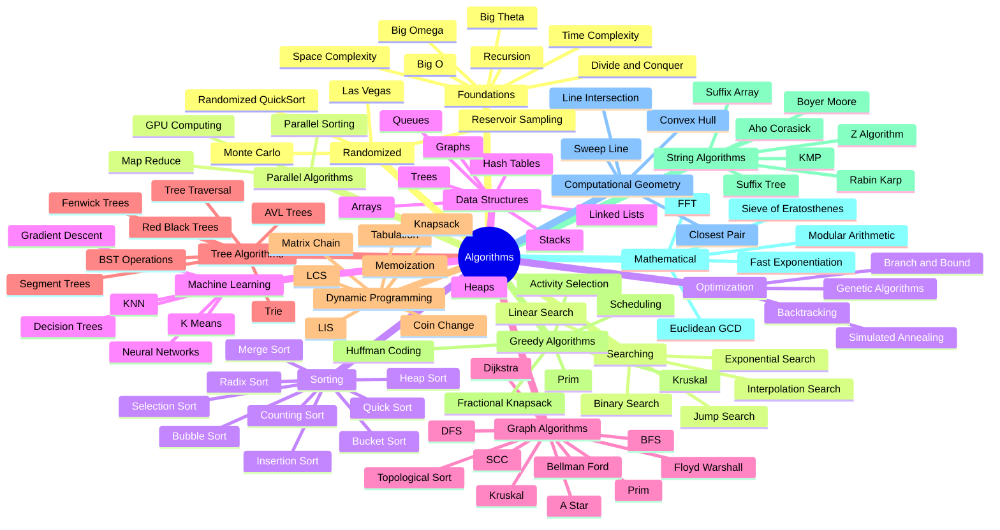

    

        
    

# [Algorithms](https://wikipedia.org/wiki/Algorithm) in [C](https://wikipedia.org/wiki/C_(programming_language))

 

    
    &nbsp;
    
    &nbsp;
    
    

## 📖 Contents
- [Searching & Sorting Algorithms](#searching--sorting-algorithms)
- [Shortest Path Algorithms](#shortest-path-algorithms)
- [My Awesome Lists](#my-awesome-lists)
- [Contributing](#contributing)
- [Contributors](#contributors)

## `Searching & Sorting` Algorithms

* **Searching Algorithms**
    * [Binary Search](https://en.wikipedia.org/wiki/Binary_search)
    * [Boyer–Moore string-search algorithm](https://en.wikipedia.org/wiki/Boyer%E2%80%93Moore_string-search_algorithm)
    * [Knuth–Morris–Pratt algorithm](https://en.wikipedia.org/wiki/Boyer%E2%80%93Moore_string-search_algorithm)
* **Sorting Algorithms**
    * [Bubble Sort](https://en.wikipedia.org/wiki/Bubble_sort)
    * [Selection Sort](https://en.wikipedia.org/wiki/Selection_sort)
    * [Insertion Sort](https://en.wikipedia.org/wiki/Insertion_sort)
    * [Quicksort](https://en.wikipedia.org/wiki/Quicksort)
    * [Merge Sort](https://en.wikipedia.org/wiki/Merge_sort)

## `Shortest Path` Algorithms 
* [Breadth First Search](https://en.wikipedia.org/wiki/Breadth-first_search)
* [Dijkstra's algorithm](https://en.wikipedia.org/wiki/Dijkstra%27s_algorithm)

---

| Algorithm | C Implementation | Best Time Complexity | Average Time Complexity | Worst Time Complexity | Worst Space Complexity |
|----|:----:|:----:|:----:|:----:|:----:|
|[Bubble sort](https://en.wikipedia.org/wiki/Bubble_sort)|[source](#)| O(n) | O(n^2) | O(n^2) | O(1) |

##

### My Awesome Lists
You can access the my awesome lists [here](https://cyberthreatdefence.com/my_awesome_lists)

### Contributing

[Contributions of any kind welcome, just follow the guidelines](contributing.md)!

### Contributors

[Thanks goes to these contributors](https://github.com/cybersecurity-dev/algorithms-in-c/graphs/contributors)!

[🔼 Back to top](#algorithms-in-c)
